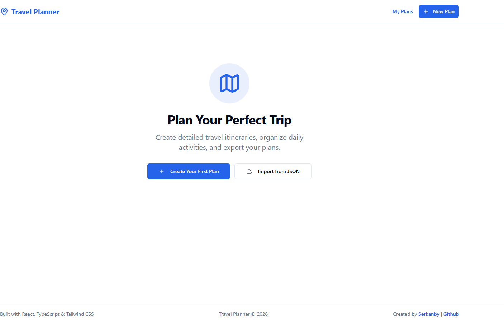
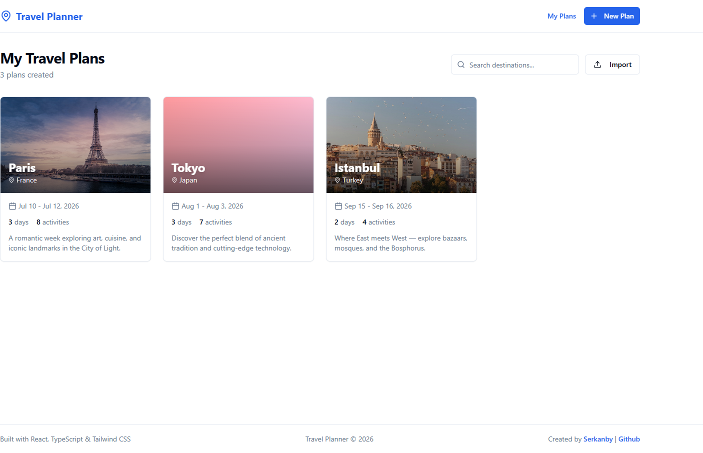
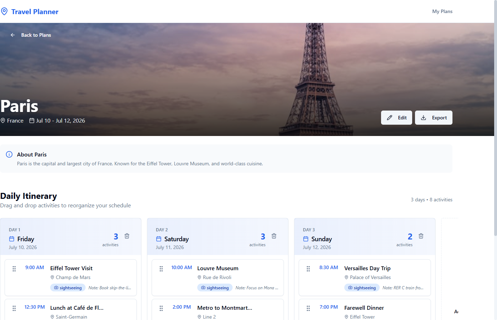
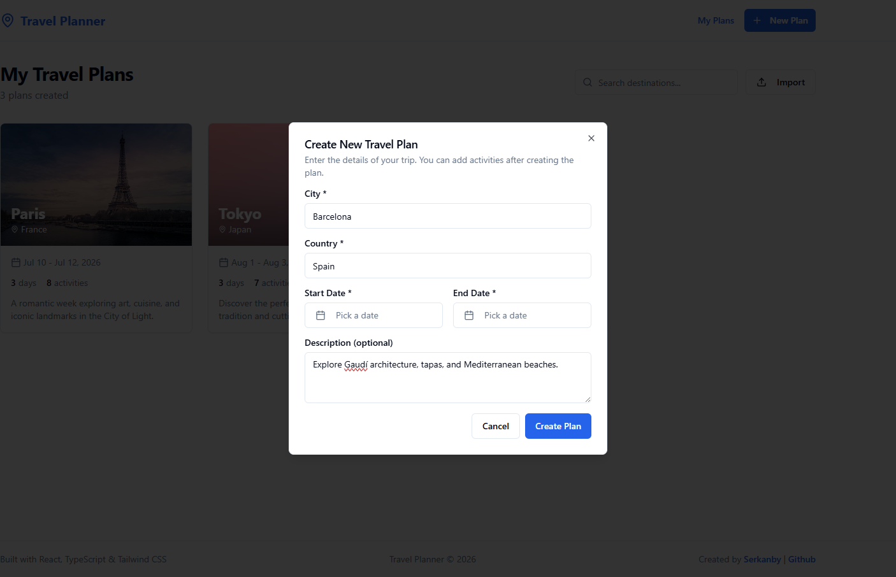
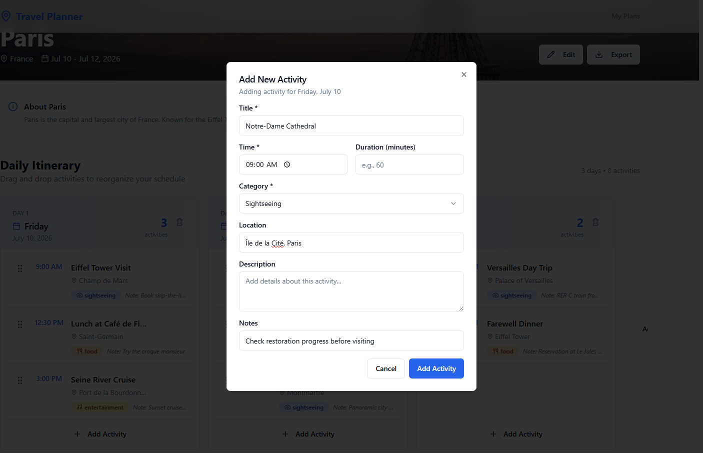

# ✈️ Travel Planner

A modern, feature-rich travel planning application built with React, TypeScript, and Tailwind CSS. Create detailed travel itineraries, organize daily activities with intuitive drag-and-drop functionality, and export your plans in multiple formats.

[](https://serkanbayraktar.com/)
[](https://github.com/Serkanbyx)
[](LICENSE)
[](https://reactjs.org/)
[](https://www.typescriptlang.org/)

## Features

- **Smart City Integration**: Automatically fetches beautiful city images from Unsplash and informative summaries from Wikipedia (localized to your browser language, falling back to English) for any destination
- **Daily Itinerary Management**: Organize your trip activities day-by-day with an intuitive timeline view; add or remove days on the fly
- **Drag & Drop Interface**: Seamlessly reorganize activities between days or reorder within the same day using smooth drag-and-drop
- **Activity Categories**: Categorize your activities (sightseeing, food, transport, accommodation, entertainment, shopping) with visual indicators
- **Full Plan Editing**: Edit a plan's destination, dates, and description at any time — activities on dates that stay in range are preserved
- **Import & Export**: Export plans as JSON (backup), Text (readable), or HTML/PDF (printable), and re-import them later from a JSON backup
- **Responsive Design**: Fully optimized for desktop, tablet, and mobile devices
- **Persistent Storage**: All plans are automatically saved to your browser's local storage
- **Modern UI Components**: Built with shadcn/ui for a clean, accessible, and consistent user experience

## Live Demo

Experience the application in action:

[🌍 View Live Demo](https://travel-plannerrr.netlify.app/plans)

> **Try the demo:** On the live site, click **Import** and select [`docs/demo-paris-plan.json`](docs/demo-paris-plan.json) to load a sample Paris itinerary with activities.

## Screenshots

### Empty State — Get Started



### My Travel Plans Dashboard



### Daily Itinerary with Drag & Drop



### Create a New Plan



### Add an Activity



## Technologies

- **React 18**: Modern React with hooks and functional components
- **TypeScript**: Type-safe development with full IntelliSense support
- **Vite**: Lightning-fast build tool and development server
- **Tailwind CSS**: Utility-first CSS framework for rapid UI development
- **shadcn/ui**: High-quality, accessible UI component library
- **Zustand**: Lightweight state management with persist middleware
- **React Hook Form**: Performant form handling with minimal re-renders
- **Zod**: TypeScript-first schema validation
- **dnd-kit**: Modern drag-and-drop toolkit for React
- **React Router v6**: Declarative routing with nested routes support
- **Unsplash API**: High-quality city images
- **Wikipedia API**: City information and summaries

## Installation

### Prerequisites

Before you begin, ensure you have the following installed:

- **Node.js** (version 18 or higher)
- **npm** or **yarn** package manager
- **Git** for version control

### Local Development

1. **Clone the repository**

```bash
git clone https://github.com/Serkanbyx/travel-planner.git
cd travel-planner
```

2. **Install dependencies**

```bash
npm install
```

3. **Configure environment variables** (Optional)

```bash
cp .env.example .env
```

Open `.env` and add your Unsplash API key for better image quality:

```env
VITE_UNSPLASH_ACCESS_KEY=your_unsplash_access_key_here
```

4. **Start the development server**

```bash
npm run dev
```

5. **Open your browser**

Navigate to [http://localhost:5173](http://localhost:5173) to see the application running.

### Build for Production

```bash
# Create optimized production build
npm run build

# Preview the production build locally
npm run preview
```

## Usage

### Creating a New Travel Plan

1. Click the **"New Plan"** button or **"Create Your First Plan"** if you have no existing plans
2. Enter the destination **city** and **country**
3. Select your **travel dates** (start and end date)
4. Add an optional **description** for your trip
5. Click **"Create Plan"** to save

### Adding Activities to Your Itinerary

1. Open any plan to view the daily itinerary
2. Click **"Add Activity"** on the desired day
3. Fill in the activity details:
   - **Title**: Name of the activity
   - **Time**: Start time for the activity
   - **Category**: Select from sightseeing, food, transport, etc.
   - **Notes**: Additional details or reminders
4. Click **"Add Activity"** to save

### Editing a Plan and Managing Days

- **Edit Plan**: Open a plan and click **"Edit"** to change the destination, dates, or description. Activities on dates that remain within the new range are preserved.
- **Add Day**: Click the **"Add Day"** card at the end of the itinerary to append the next day.
- **Remove Day**: Click the trash icon on a day column header to remove that day (available when more than one day exists).

### Reorganizing Your Schedule

- **Drag & Drop**: Click and hold any activity card, then drag it to a new position
- **Move Between Days**: Drop an activity on a different day column to reschedule
- **Reorder Within Day**: Drag activities up or down within the same day to change the order

### Exporting Your Plans

1. Click the **"Export"** button on any plan card
2. Choose your preferred format:
   - **HTML**: Beautiful printable format (save as PDF from your browser's print dialog)
   - **Text**: Simple plain text format for sharing
   - **JSON**: Data backup format for importing later

### Importing a Plan

1. On the plans page, click **"Import"** (or **"Import from JSON"** when you have no plans yet)
2. Select a previously exported `.json` plan file
3. The plan is added to your list with fresh identifiers and opened automatically

## How It Works?

### State Management with Zustand

The application uses Zustand for efficient state management with persistence:

```typescript
const useTravelStore = create(
  persist(
    (set, get) => ({
      plans: [],
      addPlan: (plan) => set((state) => ({ 
        plans: [...state.plans, plan] 
      })),
      // ... other actions
    }),
    { name: 'travel-storage' }
  )
)
```

### Drag and Drop Implementation

Activities can be reorganized using dnd-kit's powerful drag-and-drop system:

```typescript
<DndContext onDragEnd={handleDragEnd}>
  <SortableContext items={activities}>
    {activities.map((activity) => (
      <ActivityCard key={activity.id} activity={activity} />
    ))}
  </SortableContext>
</DndContext>
```

### City Data Fetching

City images and summaries are fetched automatically when creating a plan:

```typescript
// Fetch city image from Unsplash
const imageUrl = await fetchCityImage(city);

// Fetch city summary from Wikipedia
const summary = await fetchWikipediaSummary(city);
```

## Project Structure

```
src/
├── components/
│   ├── activities/     # Activity cards, forms, day columns
│   ├── layout/         # Header, Footer, Layout wrapper
│   ├── plans/          # Plan cards, create dialog
│   └── ui/             # shadcn/ui components
├── constants/          # Category definitions, app constants
├── hooks/              # Custom React hooks (useToast)
├── lib/                # Utility functions
├── pages/              # Page components (PlansPage, PlanDetailPage)
├── services/           # API services (Unsplash, Wikipedia, Export)
├── store/              # Zustand store configuration
└── types/              # TypeScript type definitions
```

> Looking for the original step-by-step roadmap used to build this app? See the [Build Guide](docs/build-guide.md).

## API Configuration

### Unsplash API (Recommended)

City cover images are fetched from the Unsplash API. An access key is required —
without it, the app gracefully falls back to a colorful gradient placeholder for
each city (the legacy anonymous `source.unsplash.com` endpoint was discontinued
by Unsplash in 2024). To enable images:

1. Create a free developer account at [unsplash.com/developers](https://unsplash.com/developers)
2. Create a new application to get your Access Key
3. Add the key to your `.env` file:

```env
VITE_UNSPLASH_ACCESS_KEY=your_access_key_here
```

> ⚠️ Never commit your `.env` file. It is already listed in `.gitignore`.

### Wikipedia API

The Wikipedia API is used without authentication to fetch city summaries. The
language edition is chosen automatically from your browser locale (Turkish or
English), falling back to English when no localized article is found. No
configuration required.

## Features in Detail

### Completed Features

✅ Create, edit, and delete travel plans  
✅ Add and remove days within a plan  
✅ Add, edit, and delete daily activities  
✅ Drag and drop activity reorganization  
✅ Multiple activity categories with icons  
✅ Export plans to HTML, Text, and JSON  
✅ Import plans from a JSON backup  
✅ Automatic city images from Unsplash  
✅ Localized city summaries from Wikipedia  
✅ Responsive mobile-first design  
✅ Persistent local storage  
✅ Form validation with Zod  

### Future Features

- [ ] User authentication and cloud sync
- [ ] Collaborative trip planning
- [ ] Budget tracking per activity
- [ ] Map integration with location markers
- [ ] Weather forecast integration
- [ ] Trip sharing via unique links

## Contributing

Contributions are welcome! Please follow these steps:

1. **Fork** the repository
2. **Create** a feature branch:

```bash
git checkout -b feature/amazing-feature
```

3. **Commit** your changes with semantic messages:

```bash
git commit -m "feat: add amazing feature"
```

**Commit message prefixes:**

| Prefix | Description |
|--------|-------------|
| `feat:` | New feature |
| `fix:` | Bug fix |
| `docs:` | Documentation changes |
| `style:` | Code style changes (formatting) |
| `refactor:` | Code refactoring |
| `test:` | Adding or updating tests |
| `chore:` | Maintenance tasks |

4. **Push** to your branch:

```bash
git push origin feature/amazing-feature
```

5. **Open** a Pull Request

Please read our [Contributing Guidelines](.github/CONTRIBUTING.md) and [Code of Conduct](.github/CODE_OF_CONDUCT.md) before contributing.

## License

This project is licensed under the **MIT License** - see the [LICENSE](LICENSE) file for details.

You are free to use, modify, and distribute this project for personal or commercial purposes.

## Developer

**Serkanby**

- 🌐 Website: [serkanbayraktar.com](https://serkanbayraktar.com/)
- 💻 GitHub: [@Serkanbyx](https://github.com/Serkanbyx)
- 📧 Email: [serkanbyx1@gmail.com](mailto:serkanbyx1@gmail.com)

## Acknowledgments

- [shadcn/ui](https://ui.shadcn.com/) - Beautiful UI components
- [Tailwind CSS](https://tailwindcss.com/) - Utility-first CSS framework
- [Unsplash](https://unsplash.com/) - High-quality free images
- [Wikipedia](https://www.wikipedia.org/) - City information
- [dnd-kit](https://dndkit.com/) - Drag and drop toolkit
- [Zustand](https://zustand-demo.pmnd.rs/) - State management
- [Vite](https://vitejs.dev/) - Next generation frontend tooling

## Contact

Have questions or suggestions? Feel free to reach out!

- 🐛 **Report a Bug**: [Open an Issue](https://github.com/Serkanbyx/travel-planner/issues)
- 💡 **Request a Feature**: [Open a Feature Request](https://github.com/Serkanbyx/travel-planner/issues/new?template=feature_request.yml)
- 📧 **Email**: [serkanbyx1@gmail.com](mailto:serkanbyx1@gmail.com)
- 🌐 **Website**: [serkanbayraktar.com](https://serkanbayraktar.com/)

---

⭐ If you like this project, don't forget to give it a star!
