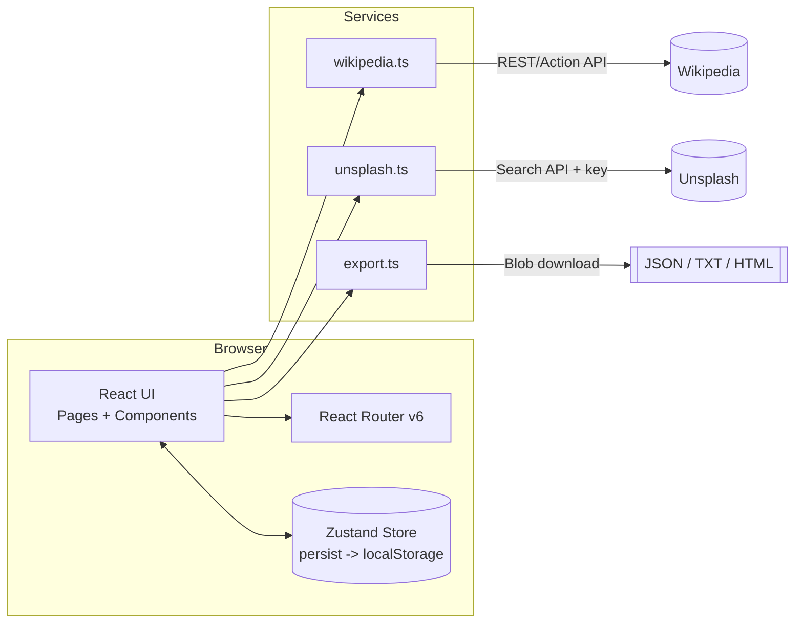

# Travel Planner — Step-by-Step Build Guide

> **Archived: original build playbook.** This document is the original roadmap used to build the Travel Planner application. It captures the intended order of work, the decisions behind each module, and the acceptance criteria for every step. The codebase may have evolved since this guide was written — for the current setup, architecture, and deployment notes, always refer to [../README.md](../README.md).

---

> **Project Summary:** Travel Planner is a client-side single-page application for planning trips. A user creates a travel plan (destination city, country, date range, optional description); the app auto-generates one day per date in the range and enriches the plan with a Wikipedia summary (localized to the browser language) and an Unsplash cover image. Within a plan, users add categorized activities (sightseeing, food, transport, accommodation, shopping, entertainment, other) to each day and reorganize them with drag-and-drop both within and across days. Plans can be edited, days added or removed, and the whole plan exported to JSON, plain text, or printable HTML, or re-imported from a JSON backup. There is no backend: all state is persisted to the browser `localStorage` via Zustand's `persist` middleware. The security surface is intentionally small — no auth, no server, secrets limited to an optional Unsplash key delivered through Vite env vars — so the emphasis is on input validation (Zod), accessibility, and resilient external-API handling.

Each step below is a self-contained prompt. Execute them in order.

Stack: React 18, TypeScript, Vite, Tailwind CSS, shadcn/ui (Radix UI), Zustand (+persist), React Hook Form, Zod, @dnd-kit, React Router v6, date-fns, lucide-react. External APIs: Wikipedia REST/Action API, Unsplash API.

---

## Table of Contents

**PHASE 1 — Project Foundation**

- STEP 1 — Project Scaffolding & Dependency Setup
- STEP 2 — Tailwind, Path Aliases & Global Styles
- STEP 3 — Domain Types & Category Constants
- STEP 4 — Utility Helpers

**PHASE 2 — State & Services**

- STEP 5 — Zustand Store with Persistence
- STEP 6 — External Services (Wikipedia, Unsplash, Export)

**PHASE 3 — UI Foundation**

- STEP 7 — shadcn/ui Primitives & Toast System
- STEP 8 — Layout & Header

**PHASE 4 — Feature Components & Pages**

- STEP 9 — Plan Components (PlanCard, CreatePlanDialog)
- STEP 10 — Activity Components (ActivityCard, ActivityForm, DayColumn)
- STEP 11 — Routing & Pages (App, main, PlansPage, PlanDetailPage)
- STEP 12 — Drag & Drop Itinerary
- STEP 13 — Plan Editing, Day Management, Import & Export

**PHASE 5 — Polish & Deploy**

- STEP 14 — Accessibility, Lint & Production Build

**Appendices**

- Appendix A — Shared Constants & Patterns
- Appendix B — Common Pitfalls
- Appendix C — Pre-flight Checklist

---

## Global Build Rules (apply to EVERY step)

- **No git operations.** Do not run `git init`, `git add`, `git commit`, `git push`, or any other `git` command. Version control is handled manually by the user.
- **No unapproved packages.** Only install the dependencies listed in STEP 1 (or explicitly required by a later step). Prefer native browser APIs over new dependencies.
- **No long-running processes** unless requested. Use `npm run build` / `npm run lint` for verification rather than leaving `npm run dev` running.
- **Treat every step as self-contained.** Each step states its goal, the files to touch, the implementation notes, and an acceptance checklist. Do not assume context beyond what a step declares.
- **Code quality.** Clean, readable, camelCase identifiers in English; modern ES6+/Hooks/async-await; DRY and reusable modules; security, accessibility (a11y) and performance prioritized at all times.
- **Secrets.** Never commit `.env`. The only secret is `VITE_UNSPLASH_ACCESS_KEY`, and the app must degrade gracefully when it is absent.

---

## Architecture at a Glance



- **UI layer**: Route-level pages (`PlansPage`, `PlanDetailPage`) composed from feature components (`PlanCard`, `DayColumn`, `ActivityCard`) and shadcn/ui primitives.
- **State layer**: A single Zustand store owns all plans, days, and activities, and is the only source of truth. The `persist` middleware mirrors it to `localStorage` under the key `travel-planner-storage`.
- **Services layer**: Pure, side-effect-light async functions for Wikipedia summaries, Unsplash images, and file export. Each fails soft (returns empty/null and logs) so the UI never crashes on a network error.
- **No server**: All persistence and computation is client-side; external calls are read-only fetches to public APIs.

---

# PHASE 1 — PROJECT FOUNDATION

---

## STEP 1 — Project Scaffolding & Dependency Setup

**Goal:** Stand up a Vite + React + TypeScript project with all runtime and dev dependencies.

**Files/folders:**

- `package.json`, `vite.config.ts`, `tsconfig.json`, `tsconfig.node.json`
- `index.html`, `src/main.tsx`, `src/App.tsx`
- `.env.example`, `.gitignore`, `eslint.config.js`

**Dependencies (runtime):**

```bash
npm install react react-dom react-router-dom zustand react-hook-form @hookform/resolvers zod \
  @dnd-kit/core @dnd-kit/sortable @dnd-kit/utilities date-fns lucide-react \
  class-variance-authority clsx tailwind-merge tailwindcss-animate react-day-picker \
  @radix-ui/react-dialog @radix-ui/react-dropdown-menu @radix-ui/react-label \
  @radix-ui/react-popover @radix-ui/react-select @radix-ui/react-slot @radix-ui/react-toast
```

**Dependencies (dev):**

```bash
npm install -D vite @vitejs/plugin-react typescript @types/react @types/react-dom @types/node \
  tailwindcss postcss autoprefixer eslint @eslint/js typescript-eslint \
  eslint-plugin-react-hooks eslint-plugin-react-refresh globals
```

**Implementation notes:**

- `package.json` scripts: `"dev": "vite"`, `"build": "tsc -b && vite build"`, `"lint": "eslint ."`, `"preview": "vite preview"`. Set `"type": "module"`.
- `vite.config.ts` registers the React plugin and the `@` -> `./src` path alias:

```typescript
export default defineConfig({
  plugins: [react()],
  resolve: { alias: { '@': path.resolve(__dirname, './src') } },
});
```

- `tsconfig.json` must mirror the alias with `"paths": { "@/*": ["./src/*"] }` and enable `strict`.
- `src/main.tsx` mounts `<App />` inside `<BrowserRouter>` and `<React.StrictMode>`, importing `./index.css`.

**Acceptance checklist:**

- [ ] `npm run dev` boots a blank app without TypeScript errors.
- [ ] Importing from `@/...` resolves correctly.
- [ ] `.env` is listed in `.gitignore`.

---

## STEP 2 — Tailwind, Path Aliases & Global Styles

**Goal:** Configure Tailwind with the shadcn/ui design-token system and global CSS variables.

**Files/folders:**

- `tailwind.config.js`, `postcss.config.js`, `src/index.css`

**Implementation notes:**

- `postcss.config.js` enables `tailwindcss` and `autoprefixer`.
- `tailwind.config.js` sets `darkMode: ['class']`, scans `./index.html` and `./src/**/*.{ts,tsx}`, defines the `container` helper, maps semantic colors (`primary`, `muted`, `destructive`, `border`, `ring`, etc.) to CSS variables, and registers `tailwindcss-animate`.
- `src/index.css` declares `@tailwind base/components/utilities` and the HSL CSS variables under `:root` (and `.dark`) consumed by the color tokens, plus a base layer applying `border-border` and `bg-background text-foreground`.

**Implementation notes (a11y/perf):** Keep color tokens HSL so contrast tweaks are trivial; rely on `bg-background/95 backdrop-blur` patterns for the sticky header rather than opaque bars.

**Acceptance checklist:**

- [ ] Tailwind utility classes apply in a sample component.
- [ ] `text-primary`, `bg-muted`, `text-destructive` resolve to themed colors.

---

## STEP 3 — Domain Types & Category Constants

**Goal:** Define the data model that every other module depends on.

**Files/folders:**

- `src/types/index.ts`
- `src/constants/categories.ts`

**Implementation notes:**

- Core interfaces: `Activity`, `Day`, `TravelPlan`, plus form DTOs `PlanFormData` and `ActivityFormData`, the `ActivityCategory` union, API response shapes `UnsplashImage` and `WikipediaResponse`, `CategoryConfig`, and the `ExportFormat` union.
- Dates inside stored entities are ISO strings (`yyyy-MM-dd`); form DTOs use real `Date` objects (the dialogs convert at the boundary).
- `categories.ts` exports `CATEGORY_CONFIG` (label/color/icon per category) and an ordered `ACTIVITY_CATEGORIES` array. Treat this as the single source for category metadata (see Appendix A).

**Acceptance checklist:**

- [ ] `ActivityCategory` covers all seven categories.
- [ ] `TravelPlan` contains `days: Day[]`, `createdAt`, `updatedAt`, optional `coverImage` and `wikiSummary`.

---

## STEP 4 — Utility Helpers

**Goal:** Provide shared, framework-agnostic helpers.

**Files/folders:**

- `src/lib/utils.ts`

**Implementation notes:**

- `cn(...inputs)` merges class names via `clsx` + `tailwind-merge` (used by every UI primitive).
- `generateId()` returns `crypto.randomUUID()` when available, with a timestamp+random fallback for older runtimes. Do not use the deprecated `String.prototype.substr`.
- `formatDate(date)` and `formatTime(time)` produce human-readable strings; `formatTime` converts `"HH:mm"` to 12-hour `"h:mm AM/PM"`.

**Acceptance checklist:**

- [ ] `cn('p-2', condition && 'hidden')` resolves correctly.
- [ ] `generateId()` returns unique values across rapid successive calls.

---

# PHASE 2 — STATE & SERVICES

---

## STEP 5 — Zustand Store with Persistence

**Goal:** Implement the single source of truth for plans, days, and activities.

**Files/folders:**

- `src/store/useTravelStore.ts`

**Implementation notes:**

- Wrap the store in `persist(..., { name: 'travel-planner-storage' })`.
- Extract a `buildDays(startDate, endDate)` helper (using `eachDayOfInterval` + `format`) and reuse it from both `addPlan` and `editPlan` (DRY).
- Actions:
  - `addPlan(data) => string` — creates a plan, generates days, returns the new id.
  - `updatePlan(id, partial)` — shallow merge + bump `updatedAt`.
  - `editPlan(id, data: PlanFormData)` — updates core fields and **reconciles days when the date range changes**: keep existing days whose `date` is still in range (preserving their activities), create empty days for new dates, drop out-of-range days.
  - `deletePlan(id)`, `getPlan(id)`.
  - `importPlan(plan) => string` — clones an imported plan with **fresh ids** for the plan, every day, and every activity to avoid collisions; resets timestamps.
  - Day actions: `addDay(planId, date)` (insert sorted by date), `removeDay(planId, dayId)`.
  - Activity actions: `addActivity` (insert then sort by `time`), `updateActivity` (merge then re-sort), `deleteActivity`, `moveActivity(planId, sourceDayId, targetDayId, activityId, newIndex)` (cross-day move), `reorderActivities(planId, dayId, activeId, overId)` (within-day reorder).
- Every mutation returns new object/array references (immutability) and updates `updatedAt`.

**Acceptance checklist:**

- [ ] Reloading the page restores all plans from `localStorage`.
- [ ] `editPlan` keeps activities on retained dates and discards out-of-range days.
- [ ] `importPlan` produces ids that differ from the source file.

---

## STEP 6 — External Services (Wikipedia, Unsplash, Export)

**Goal:** Encapsulate all I/O behind small, fail-soft async functions.

**Files/folders:**

- `src/services/wikipedia.ts`
- `src/services/unsplash.ts`
- `src/services/export.ts`

**Implementation notes:**

- **Wikipedia** (`fetchCitySummary(city, country?, lang?)`): pick `lang` from `navigator.language` (`tr` or `en`), default `en`. Search via the Action API (`list=search`, `origin=*`), then fetch the REST summary. If a localized edition has no match, fall back to English. On any error, log and return `null`. Also expose `fetchCityShortDescription`.
- **Unsplash** (`fetchCityImage(city)`): require `VITE_UNSPLASH_ACCESS_KEY`. When the key is missing, return `''` so the UI shows a gradient placeholder — **do not** use the discontinued `source.unsplash.com` endpoint. On success return `urls.regular`; on error return `''`. Also expose `getCityGradient(city)` returning a deterministic gradient derived from the city name.
- **Export** (`exportAsJson` / `exportAsText` / `exportAsHtml`): build a `Blob` and trigger a download via a shared `downloadBlob(blob, filename)` helper that creates a temporary `<a>` and revokes the object URL afterward. The HTML export embeds print-friendly CSS (`@media print`, category color classes).

**Implementation notes (security/perf):** All fetches are read-only; never interpolate unsanitized user input into the HTML export without escaping intent in mind (content originates from the user's own plan, but keep the template structure fixed).

**Acceptance checklist:**

- [ ] With no Unsplash key, `fetchCityImage` returns `''` and the UI falls back to a gradient.
- [ ] Turkish browser locale fetches `tr.wikipedia.org` first, then falls back to English.
- [ ] Each export produces a correctly named downloadable file.

---

# PHASE 3 — UI FOUNDATION

---

## STEP 7 — shadcn/ui Primitives & Toast System

**Goal:** Add the accessible, themeable UI building blocks.

**Files/folders:**

- `src/components/ui/`: `button.tsx`, `input.tsx`, `textarea.tsx`, `label.tsx`, `card.tsx`, `badge.tsx`, `dialog.tsx`, `dropdown-menu.tsx`, `select.tsx`, `popover.tsx`, `calendar.tsx`, `toast.tsx`, `toaster.tsx`
- `src/hooks/useToast.ts`

**Implementation notes:**

- Primitives wrap Radix UI components and use `cva` (class-variance-authority) for variants plus the `cn` helper. `button.tsx` and `badge.tsx` export both the component and a `*Variants` function.
- `badge.tsx` should support a variant per activity category so cards can color-code.
- `calendar.tsx` wraps `react-day-picker`; `dialog.tsx`, `dropdown-menu.tsx`, `select.tsx`, `popover.tsx` wrap their Radix equivalents with themed styling.
- `useToast.ts` is the standard shadcn toast reducer/store exposing `toast(...)` and `useToast()`. `toast` accepts `title`, `description`, and a `variant` (`default` | `destructive`). `toaster.tsx` renders the active toasts and must be mounted once in the layout.
- Keep `InputProps`/`TextareaProps` as `type` aliases (not empty interfaces) to satisfy `@typescript-eslint/no-empty-object-type`.

**Acceptance checklist:**

- [ ] `toast({ title, description, variant: 'destructive' })` renders a styled toast.
- [ ] `npm run lint` reports no errors from the ui primitives.

---

## STEP 8 — Layout & Header

**Goal:** Provide the shared page chrome.

**Files/folders:**

- `src/components/layout/Layout.tsx`
- `src/components/layout/Header.tsx`

**Implementation notes:**

- `Layout` renders a sticky `Header`, a `<main>` for children, a footer with credits, and mounts `<Toaster />` exactly once. It accepts an optional `onCreatePlan` callback forwarded to the header.
- `Header` shows the brand link, a "My Plans" nav link (active state via `useLocation`), and — only on the plans route when `onCreatePlan` is provided — a "New Plan" button.

**Acceptance checklist:**

- [ ] Header sticks to the top with a blurred translucent background.
- [ ] Toaster is mounted once and visible app-wide.

---

# PHASE 4 — FEATURE COMPONENTS & PAGES

---

## STEP 9 — Plan Components (PlanCard, CreatePlanDialog)

**Goal:** List/summary card plus the create/edit dialog.

**Files/folders:**

- `src/components/plans/PlanCard.tsx`
- `src/components/plans/CreatePlanDialog.tsx`

**Implementation notes:**

- `PlanCard` links to `/plan/:id`, lazily fetches a cover image (falling back to `getCityGradient`), and exposes a delete action in a dropdown. Track `imageLoaded` / `imageError` to cross-fade or fall back to the gradient.
- `CreatePlanDialog` is **dual-mode**: when `initialData` is provided it acts as an edit dialog (prefilled, "Save Changes"), otherwise create mode ("Create Plan"). Validate with a Zod schema (`city`/`country` min length, both dates required, `endDate >= startDate` via `.refine`). Dates are chosen with `Popover` + `Calendar`. Reset the form when the dialog opens (sync prefilled values via `useEffect`).

**Acceptance checklist:**

- [ ] Submitting create mode produces a valid `PlanFormData` with `Date` objects.
- [ ] Passing `initialData` prefills the form and switches button labels.
- [ ] End-before-start dates show a validation error.

---

## STEP 10 — Activity Components (ActivityCard, ActivityForm, DayColumn)

**Goal:** The draggable activity card, its form, and the per-day droppable column.

**Files/folders:**

- `src/components/activities/ActivityCard.tsx`
- `src/components/activities/ActivityForm.tsx`
- `src/components/activities/DayColumn.tsx`

**Implementation notes:**

- `ActivityCard` uses `useSortable` (id = activity id, data `{ type: 'activity', activity }`). It renders a drag handle, the formatted time/duration, title/location/description, a category `Badge` with the matching lucide icon, and hover-revealed edit/delete buttons. Every icon-only control needs an `aria-label` (see STEP 14).
- `ActivityForm` is a `Dialog` driven by React Hook Form + Zod. Fields: title (required), time (required, `type="time"`), duration (coerced number), category (`Select` via `Controller`), location, description, notes. Reset/prefill on open based on the `activity` prop (edit vs add).
- `DayColumn` uses `useDroppable` (id = day id, data `{ type: 'day', day }`), shows the day index/weekday/date and activity count, wraps cards in a `SortableContext` with `verticalListSortingStrategy`, renders an empty-state prompt, and exposes an optional `onRemoveDay` trash button.

**Acceptance checklist:**

- [ ] Adding an activity sorts it into the day by time.
- [ ] The category badge shows the correct icon and color.
- [ ] `onRemoveDay`, when provided, renders a labeled remove button.

---

## STEP 11 — Routing & Pages (App, main, PlansPage, PlanDetailPage)

**Goal:** Wire routes and assemble the two pages.

**Files/folders:**

- `src/App.tsx`, `src/main.tsx`
- `src/pages/PlansPage.tsx`
- `src/pages/PlanDetailPage.tsx`

**Implementation notes:**

- `App` defines routes: `/` -> redirect to `/plans`, `/plans` -> `PlansPage`, `/plan/:id` -> `PlanDetailPage`, `*` -> redirect to `/plans`.
- `PlansPage`: empty-state hero vs. grid of `PlanCard`s, a search box filtering by city/country, the create dialog, and (STEP 13) the import control. Creating a plan navigates to its detail page.
- `PlanDetailPage`: reads `:id`, fetches the plan from the store, renders a hero (cover image/gradient + dates + export menu), the Wikipedia summary, and the itinerary. Handle "plan not found" gracefully. On mount, lazily fetch and persist `wikiSummary` and `coverImage` when missing.

**Acceptance checklist:**

- [ ] Unknown routes redirect to `/plans`.
- [ ] A missing plan id renders a friendly "Plan not found" view.

---

## STEP 12 — Drag & Drop Itinerary

**Goal:** Robust multi-container drag-and-drop across days.

**Files/folders:**

- `src/pages/PlanDetailPage.tsx` (DnD wiring)

**Implementation notes:**

- Configure `DndContext` with `PointerSensor` (activation distance 8px) + `KeyboardSensor` (`sortableKeyboardCoordinates`) and `closestCorners` collision detection.
- **Stability rule:** handle *cross-day moves* in `onDragOver` only (so the card visually lands in the target column), and defer *within-day reordering* to `onDragEnd`. This avoids excessive store writes and the jitter caused by reordering on every over-event.
- Use a `findDayIdByActivity(activityId)` helper. Render a `DragOverlay` showing the active card.

**Acceptance checklist:**

- [ ] Dragging a card to another day moves it and persists.
- [ ] Reordering within a day commits once on drop.
- [ ] Keyboard drag works for accessibility.

---

## STEP 13 — Plan Editing, Day Management, Import & Export

**Goal:** Expose the store's edit/day/import/export capabilities in the UI.

**Files/folders:**

- `src/pages/PlanDetailPage.tsx`, `src/pages/PlansPage.tsx`

**Implementation notes:**

- **Edit plan:** an "Edit" button in the detail hero opens `CreatePlanDialog` with `initialData` built from the plan (convert ISO strings back to `Date` via `parseISO`), submitting to `editPlan`.
- **Add day:** an "Add Day" card at the end of the columns computes the next date (`addDays(parseISO(lastDay.date), 1)`, or `startDate` if empty) and calls `addDay`.
- **Remove day:** pass `onRemoveDay` to `DayColumn` only when more than one day exists; calls `removeDay`.
- **Export:** dropdown wired to `exportAsJson` / `exportAsText` / `exportAsHtml`, each with a confirmation toast.
- **Import (PlansPage):** a hidden `<input type="file" accept="application/json">` triggered by an "Import" button. Read the file, `JSON.parse`, validate with a minimal `isValidPlan` type guard, call `importPlan`, then navigate to the new plan. Show a `destructive` toast on failure.

**Acceptance checklist:**

- [ ] Editing dates preserves activities on retained days.
- [ ] Add/remove day updates the itinerary and persists.
- [ ] Importing a previously exported JSON recreates the plan with new ids.
- [ ] Importing an invalid file shows an error toast and does not corrupt state.

---

# PHASE 5 — POLISH & DEPLOY

---

## STEP 14 — Accessibility, Lint & Production Build

**Goal:** Final hardening and a clean, shippable build.

**Files/folders:**

- Cross-cutting: all interactive components; `eslint.config.js`; `README.md`

**Implementation notes:**

- **Accessibility:** every icon-only control (drag handle, edit, delete, remove-day, dropdown triggers) must carry a descriptive `aria-label` (e.g. ``aria-label={`Edit ${activity.title}`}``). Buttons that are not submit buttons set `type="button"`. Preserve keyboard drag support and visible focus rings.
- **Lint:** run `npm run lint`. Resolve real errors (empty-interface types, unused values). The two `react-refresh/only-export-components` warnings on `button.tsx`/`badge.tsx` are the standard shadcn pattern (component + `*Variants` exported together) and are acceptable.
- **Build:** run `npm run build` (`tsc -b && vite build`) and confirm a zero-error type check and a successful bundle. The single chunk exceeding 500 kB is expected for this app; optionally address later with `manualChunks` or dynamic imports.
- **Docs:** keep `README.md` and this guide consistent with the implemented features (Unsplash key requirement, Wikipedia localization, edit/import/day-management).
- **Deploy:** ship the static `dist/` output to any static host (e.g. Netlify). Provide `VITE_UNSPLASH_ACCESS_KEY` as a build-time env var in the host for cover images; the app still works without it via gradients.

**Acceptance checklist:**

- [ ] `npm run build` completes with exit code 0 and no type errors.
- [ ] `npm run lint` reports no errors (warnings limited to the known shadcn fast-refresh ones).
- [ ] All icon-only controls expose accessible labels.
- [ ] The production preview renders plans, itineraries, drag-and-drop, export, and import.

---

# Appendix A — Shared Constants & Patterns

- **Persistence key:** `travel-planner-storage` (Zustand `persist`).
- **Path alias:** `@` -> `./src` (declared in both `vite.config.ts` and `tsconfig.json`).
- **Activity categories** (`src/constants/categories.ts`): `sightseeing`, `food`, `transport`, `accommodation`, `shopping`, `entertainment`, `other` — each with `{ label, color, icon }`. Reuse `CATEGORY_CONFIG` and `ACTIVITY_CATEGORIES` everywhere; never hardcode category lists elsewhere.
- **Date conventions:** stored dates are `yyyy-MM-dd` ISO strings; convert to `Date` at form boundaries with `parseISO` and back with `format`.
- **DnD data contract:** sortable activities carry `data: { type: 'activity', activity }`; droppable days carry `data: { type: 'day', day }`. Cross-day logic keys off these `type` discriminators.
- **Fail-soft services:** every service returns `''`/`null` on error and logs to console; the UI must never depend on a service throwing.
- **`cn` everywhere:** all conditional class logic goes through `cn(...)` to keep Tailwind merge behavior consistent.

---

# Appendix B — Common Pitfalls

- **Discontinued Unsplash Source:** `source.unsplash.com` was shut down in 2024. Do not reintroduce it as a fallback; use the API with a key, otherwise a gradient.
- **`new Date('yyyy-MM-dd')` timezone shift:** parsing bare ISO dates as UTC midnight can shift the displayed day. Prefer `parseISO` from date-fns for plan dates.
- **Reordering in `onDragOver`:** doing within-day reordering on every over-event causes jitter and excessive renders. Reorder in `onDragEnd`; only move across containers in `onDragOver`.
- **Id collisions on import:** an imported plan must get fresh ids for the plan, days, and activities, or drag/edit operations will target the wrong entities.
- **Empty interface lint error:** `interface Props extends X {}` triggers `@typescript-eslint/no-empty-object-type`; use `type Props = X` instead.
- **Mutating store state:** always return new references in `set(...)`; never mutate `plan.days` or `day.activities` in place.
- **Forgetting `aria-label`:** icon-only buttons are invisible to screen readers without labels.

---

# Appendix C — Pre-flight Checklist

- [ ] `npm install` succeeds; only approved dependencies present.
- [ ] `.env.example` documents `VITE_UNSPLASH_ACCESS_KEY`; real `.env` is gitignored.
- [ ] `npm run lint` — no errors.
- [ ] `npm run build` — type check passes, bundle emitted.
- [ ] Create a plan -> days auto-generated; Wikipedia summary and cover (or gradient) load.
- [ ] Add/edit/delete activities; drag within and across days persists.
- [ ] Edit plan dates -> days reconciled, in-range activities preserved.
- [ ] Add/remove days works (remove hidden when only one day remains).
- [ ] Export JSON/Text/HTML; re-import the JSON and verify a fresh plan opens.
- [ ] Reload the page -> all data restored from `localStorage`.

---

This guide reflects the implementation as built. When the code and this document disagree, treat the code as authoritative and update the guide accordingly.

